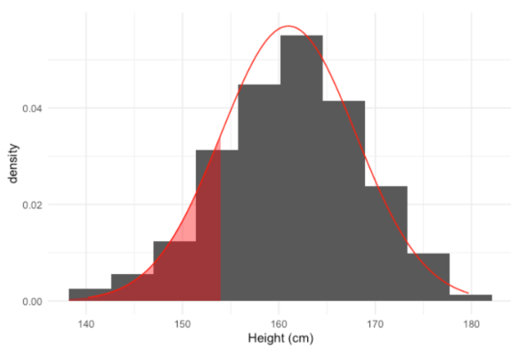

# Chapter 1: Matplot
first thing we need to import library
```
import matplotlib.pyplot as plt
```
there is typt of plots like line or scatter.<br>
**line plot** we use it when we need to Tracking changes over time to show line plot
```
plt.plot(x-axis,y-axis)
```
**scatter plot** we use it to identify correlations and this dont need to make title
```
plt.scatter(x-axis,y-axis)
```
**Hystogram plot** we use it to get idea about distribution
```
plt.hist()
```
to show the plot
```
plt.show()
```
to label the plot
```
plt.xlabel()
plt.ylabel()
plt.title()
```
to specify the value in axis 
```
plt.yticks([ , , , ])
```
to change the scale of axis
```
plt.xscale('type of scale you want')
```
to add value in the plot 
```
plt.text(x-val,y-val,s:str)
```

# Chapter 2: dict and panda
**Dict:** list=[ , , , ] it is not acceptable to change the value in it after make it 
dict={'key':value,'key':value,---} you can change the value of any key and you can insert new key but must be each key is unique and value 
```
dict['new key']=value
```
if you want to delete key 
```
del(dict['key'])
``` 
to get the value of the key 
```
dict['key']>> value
```
you can make dict in dict
```
dict={'keyout':{'keyin':value,'keyin':value,---},
      'keyout2':{'keyin1':value,'keyin':value,---}
      'keyout3':{'keyin2':value,'keyin':value,---}
}
```
if you want to get the value of the iner dict
```
dict['keyout']['keyin']
```
**Panda**
to import panda
```
import panda as pd
```
to create dataframe from dict
```
object=pd.DataFrame(dict_name)
```
to specify index of data frame
```
dataframe_name.index=[]
```
you can read from csv file
```
dataframe_name=pd.read_csv('name of file or the path of file',index_col=0)
```
to search about row
```
dataframe_name.loc['name of row'] >>to show data in row
```
**or**
```
dataframe_name.loc[['name of row']] >>to show data in colum
```
to show the row with index
```
dataframe_name.iloc[[index]]
```
to filter the data frame 
```
dataframe[condition]
```
**like**
```
dataframe[np.logical_and(dataframe['']>10,dataframe['']<20)]
```
we use np for filter when we need to filter more than one item 
to make for loop in dict we use item
```
world={"key":value,"key1":value1}
for key,value in world.item():
    print(key + str(value))
```
and if you want to print numpy array 
```
np.nditer(array)
```
there is a way to loop in numpay array
```
for lab,row in brics.iterrows():
```

___
# Data Manipulation with pandas
## Chapter 1
to know the dimansion of data frame
```
dataframe.shape() >> (x,y) 
```
to know the name of column
```
dataframe.columns()
```
When you get a new DataFrame to work with, the first thing you need to do is explore it and see what it contains. There are several useful methods and attributes for this.
<br>
```.head()``` returns the first few rows (the “head” of the DataFrame).<br>
```.info()``` shows information on each of the columns, such as the data type and number of missing values.<br>
```.shape``` returns the number of rows and columns of the DataFrame.<br>
```.describe()``` calculates a few summary statistics for each column.<br>

To better understand DataFrame objects, it's useful to know that they consist of three components, stored as attributes:<br>
```.values```: A two-dimensional NumPy array of values.<br>
```.columns```: An index of columns: the column names.<br>
```.index```: An index for the rows: either row numbers or row names.<br>

Finding interesting bits of data in a DataFrame is often easier if you change the order of the rows. You can sort the rows by passing a column name to ```.sort_values()```.<br>
In cases where rows have the same value (this is common if you sort on a categorical variable), you may wish to break the ties by sorting on another column. You can sort on multiple columns in this way by passing a list of column names.<br>
one column	```df.sort_values("breed")```<br>
multiple columns	```df.sort_values(["breed", "weight_kg"])```
## Chapter 2
Summary statistics are exactly what they sound like - they summarize many numbers in one statistic. For example ```.mean```, ```.median```, ```.min```, ```max```, and ```.std(standard deviation)```are summary statistics. Calculating summary statistics allows you to get a better sense of your data, even if there's a lot of it.

While pandas and NumPy have tons of functions, sometimes, you may need a different function to summarize your data.

The ```.agg()``` method allows you to apply your own custom functions to a DataFrame, as well as apply functions to more than one column of a DataFrame at once, making your aggregations super-efficient. For example,
```
def iqr(column):
    return column.quantile(0.75) - column.quantile(0.25)    
print(sales['temperature_c'].agg(iqr))
```
```
def iqr(column):
    return column.quantile(0.75) - column.quantile(0.25)
print(sales[["temperature_c", "fuel_price_usd_per_l", "unemployment"]].agg([iqr,np.median]))
```
to sure the data dont has a duplicate data 
```
df.drop_duplicates[subset='column']
```
to count the apper of something 
```
df['column'].value_counts()
# to sort it 
df['column'].value_counts(sort=True)
# to get the percentage
df['column'].value_counts(normlize=True)
```
to group data
```
df.groupby()
```
In pandas, pivot tables are essentially another way of performing grouped calculations. That is, the ```.pivot_table()``` method is an alternative to ```.groupby()```<br>
```
import numpy as np
mean_sales_by_type_holiday = sales.pivot_table(values='weekly_sales',index='type',columns='is_holiday',aggfunc=np.mean)
print(mean_sales_by_type_holiday)
```

The ```.pivot_table()``` method has several useful arguments, including fill_value and margins.
```fill_value ```replaces missing values with a real value (known as imputation). What to replace missing values with is a topic big enough to have its own course (Dealing with Missing Data in Python), but the simplest thing to do is to substitute a dummy value.
``` margins``` is a shortcut for when you pivoted by two variables, but also wanted to pivot by each of those variables separately: it gives the row and column totals of the pivot table contents.
In this exercise, you'll practice using these arguments to up your pivot table skills, which will help you crunch numbers more efficiently!
-to get the overview of data sum of columns and rows-

## Chapter 3
to make index of df after applied 
```
df.set_index()
```
and to rest it 
```
df.rest_index()
# to remove the index
df.rest_index(drop=True)
```
```
# Make a list of cities to subset on
cities = ["Moscow", "Saint Petersburg"]

# Subset temperatures using square brackets
print(temperatures[temperatures['city'].isin(cities)])

# Subset temperatures_ind using .loc[]
print(temperatures_ind.loc[cities])
```
Indexes can also be made out of multiple columns, forming a multi-level index (sometimes called a hierarchical index). There is a trade-off to using these.

The benefit is that multi-level indexes make it more natural to reason about nested categorical variables. For example, in a clinical trial, you might have control and treatment groups. Then each test subject belongs to one or another group, and we can say that a test subject is nested inside the treatment group. Similarly, in the temperature dataset, the city is located in the country, so we can say a city is nested inside the country.<br>
The main downside is that the code for manipulating indexes is different from the code for manipulating columns, so you have to learn two syntaxes and keep track of how your data is represented<br>
Previously, you changed the order of the rows in a DataFrame by calling ```.sort_values()```. It's also useful to be able to sort by elements in the index. For this, you need to use ```.sort_index()```.

to search in the inner index you should first pass through first
```
df.loc[("lab","brown"):("schnauzer","brown")]
```
and you can slice the column
```
df.loc[:,"column_1":"column_n"]
```
want to subset use loc this is the most common way<br>
It's interesting to see how temperatures for each city change over time—looking at every month results in a big table, which can be tricky to reason about. Instead, let's look at how temperatures change by year.<br>
You can access the components of a date (year, month and day) using code of the form ```dataframe["column"].dt.component```. For example, the month component is ```dataframe["column"].dt.month```, and the year component is ```dataframe["column"].dt.year```.
Once you have the year column, you can create a pivot table with the data aggregated by city and year, which you'll explore in the coming exercises.

## Chapter 4
to make bar plot
```
df.plot(kind="bar") # when we have df 
```
**or**
``` 
plt.plot(x='val-x',y='val-y',kind='bar')
```
**Bar plots** are great for revealing relationships between **categorical** and **numeric** variables, but you'll often have to manipulate your data first in order to get the numbers you need for plotting.<br>
**Scatter plots** are ideal for visualizing relationships between numerical variables.<br>
to know if there is null value in data frame use ```.isna()``` to check each value but it's not efficient if you work with the big data so we use ```.isna().any()``` to check in each column or ```.isna().sum()``` to know number of null value in each column.<br>
**option to solve this problem**<br>
1. to delete all null value by ```.dropna()``` 
2. to replace null value to zero```.fillna(0)```

you can make data frame by 2 method:
1. list of dictionary 
```
list_dict=[
    { : , : , : , : } ,
    { : , : , : , : }, 
    ........ 
    ........
]
``` 
this method build the data frame row by row<br> 
2. dictionary of list
```
dict_list={
    'name':[ , , , , , , , ],
    'bread':[ , , , , , , , ],
    ................., 
    ................., 
}
```
this method built the data frame column by bolumn<br>
**important note:**
In pandas, the axis parameter determines the direction along which an operation is applied:

```axis=0``` : Operates column-wise (down the rows for each column).
This means the operation applies to all rows within a single column.
For example, .sum(axis=0) calculates the sum of values in each column.<br>
```axis=1 ```: Operates row-wise (across the columns for each row).
This means the operation applies to all columns within a single row.
For example, .sum(axis=1) calculates the sum of values in each row.


____
# Joining Data with pandas
## Chapter 1
you have 2 table and want to merge -join- between them 
```
df1.merge(df2,on='commend column between them',suffixes=())
```
it's like inner join in sql and the output is the common between two table<br>
**suffixes** is used to specifi which one belong to each table<br>
**there are type of relationship:**<br>
1.  one-to-one relationship<br>
this each table has the common row 
2. one-to-many <br>
this mean there more than one common

when we have one to many we need after merge to group them <br>
to merge mult table 
```
# Merge licenses and zip_demo, on zip; and merge the wards on ward
licenses_zip_ward = licenses.merge(zip_demo,on='zip') \
            			.merge(wards,on='ward')
# Print the results by alderman and show median income
print(licenses_zip_ward.groupby('alderman').agg({'income':'median'}))
```
## Chapter 2
left join the output is the left join with the match in right tablex

```
df.merge(df1,on='',how='left')
```
to right join
```
df.merge(df1,how='right',left_on='',right_on='')
```
**outer join** it's return two table as it

```
df.merge(df1,on='',how='outer')
```
merge a table to itself
```
df.merge(df,left_on='',right_on='',suffixes=('',''))
```
there are **semi join** is like inner join but it return only the left table 

here we first make inner join 
```
inner_join=df.merge(df2.on='gid')
semi_join=df[inner_join['gid].isin(df['gid'])]
```
**anti join** this is return the one doesnt match

first we use left join

to make table connect verticaly or one top other we use```.concat()```and must the table has the same column name
```
pd.concat([df1,df2,df3],
            ignore_index=True,#to make index start from 0 to n-1
            key=[]#to make it clear where the starting of each table
            join=inner#if you want to show all the data in all table
            sort=True#if you want to sort 
)
```
## Chapter 4
```merge_ordered``` merge two table and the result is the two table

```
pd.merge_ordered(df1,df2,on='')
```
we can fill the missing data by forward **fill method**
we fill the missing value with the previous data 
```
pd.merge_ordered(df1,df2,on='',fill_method='ffill')
```
when are we use the merge_ordered instead of ordinary merge ?<br>
* ordered data/time series
* filling in missing value<br>

**merge_asof()** it's like merge_ordered but match the nearest key  
<br>

```
pd.merge_asof(df1,df2,on='',suffixes=(''),direction='')
```
the direction is define what the data take when there is it the nearest forward of backward[forward,backward,nearest]
when are we use this method
* data sample from a process
* developing a training set(no data )

if you want to know the change overtime we can use ```df.diff()```

also,there's ```.query()```
it's used to return some of rows you want it like ```where``` in sql
```
df.query('condition') 
#social_fin.query('company=="Facebook"')
```
it's like 
```
df=df[df['column']=='somthing']
```
and can use ```and``` and ```or``` <br>
**reshape data** by ```.melt()``` there are two type wide format or long format and the gool is to make the wide to lang for computer

```
df.melt(id_vars=['put here the column dont need to change'],var_name='to change the name of the variable column',value_name='to change the name of the value column ')
```
# Introduction to statistics in python
## Ch1 Summary Statistics
There are types of statistics
* Descriptive statistics
    * Describe and summarize data
* Inferential statistics
    * use a sample of data to make inferences about a larger population

There is a two types of data
* Numeric(Quantitaive)
    * Continuous (measured)
        * Airplane  speed
        * Time spent waiting in line
    * Discrete(counted)
        * Number of petes
* Categorical(Qualitative)
    * Nominal(Unordered)
        * Married
        * country of residance
    * Ordinal(Ordered)
        * survie question<br>

some times categorical represent by using numbers<br>
mode is the only one can used in categorical data<br>
mean is more sensative for data than medial, the mean most use it in symetrical data<br>
when data not symetrical there is two kind
* left-skewed  
* right-skewed


the mean tend to tail and for this we prefere using median instead of mean
if you want to make two operation in one column at the same time without save it you can use ```.agg``` ,agg use in it the name of function

**How can we Measures the spread of data?**<br>

1. Variance <br>
is the average distance from each data point to the data's mean

to calculate the variance we need to
    1. calculate the distance between each data point to the mean
    2. square each distance
    3. sum squared distance
    4. Divide by number of data points-1 <br>
the higher the variance the more spread the data<br>
it can be calculate by one step in python by 
    ```
    np.var(data,ddof=1)
    ```
    we put ddof equal to 1 to get variance of sample

2. standart deviation<br>
    it's square root of variance<br> 
    or we can use
    ```
    np.std(data,ddof=1)
    ```
3. Mean absolute deviation<br>
    ```
    dists=msleep['total_sleep']-mean(msleep$sleep_total)
    np.mean(np.abs(dists))
    ```
    the result will be near to standart deviation<br>
    
4. Quantile<br> 
    **What Are Quantiles?**<br>
    Quantiles are values that divide a dataset into equal-sized groups based on the distribution of the data. Each group contains an approximately equal number of observations (or data points). Quantiles help summarize the spread and structure of the data.
    ```
    np.quantile(df['total_of_something'],0.5)
    ```
    and boxplot use the idea of quartiles<br>
    second quartile is the mean<br>
    we can create the same quartile
    ```
    # np.linspace(start,end,num)
    print(np.quantile(food_consumption['co2_emission'],np.linspace(0,1,6)))
    ```
5.  **Interquartile Range(IQR)**<br>
    it's the distance between 25% and 75%
    ```
    np.quantile(df[''],0.75)-np.quantile(df[''],0.25)
    ```
    you can make it more easier
    ```
    import scipy.stats import iqr
    iqr(df[''])
    ```
    **outlier** data point that is substantially different from the others<br>
    how do we know what a substantial difference is? the data is an outlier if:
    * data< Q1-1.5 x IGR or
    *  data> Q3+1.5 x IGR 


and we can called ( ) rule

**example code about IQR**
```
# Calculate total co2_emission per country: emissions_by_country
emissions_by_country = food_consumption.groupby('country')['co2_emission'].sum()

# Compute the first and third quantiles and IQR of emissions_by_country
q1 = np.quantile(emissions_by_country, 0.25)
q3 = np.quantile(emissions_by_country, 0.75)
iqr = q3 - q1

# Calculate the lower and upper cutoffs for outliers
lower = q1 - 1.5 * iqr
upper = q3 + 1.5 * iqr

# Subset emissions_by_country to find outliers
outliers = emissions_by_country[(emissions_by_country<lower) | (emissions_by_country>upper) ]
print(outliers)
```
## Chapter 2 Random Numbers and Probability(discrete-binom-continuous)
there is two way to select data from sample 
* sampling without replacement -to number choosen will not return-
* sampling with replacement  -to number choosen will return-<br>

to get the random number from data we use
```data.sample(number of sample you want to choose,replace=True/False)``` and this each time run will give different output.<br>
if you want to get the same output each time you run it
```
np.random.seed(any_number)
data.sample()
```
**Probability distribution**<br>
Describe the probability of each possible outcome in a scenario<br>
**expected Value:** <br>
*Mean* of a probability distribution<br>

this is mean that the average in discrete is expected value and in continous is mean<br>
we can represent the probability=Area<br>
**Law of large numbers**<br>
As the size of your sample increases,the sample mean will approach the expected value
**Continuous distributions**<br>
uniform distribution in python to get the probability of geting number in continuous distribution
```
from scipy.stats import uniform
uniform.cdf(upper,lower,total) # the out is prop and cdf is continuous distribution function
```
if you want to generate random number according to uniform distribution 
```
    uniform.rvs(start,end,number of sequence)#rvs is random variable sequence
```
**The Binomial distribution**<br>
It's probability distribution of the number of successes in a sequence of **independent** trials<br>
you have two probability win or loss
```
from scipy.stats import binom
```
to get sequence of binomial or to simulate the prob  
```
binom.rvs(# of coins,probability of success,size=# of trials)
```
if you want to get the probability to show something in binomial 
What's the probability to get 7 heads?<br>
```
# binom.pmf(num of sucess, num trial,prob_of_sucess)
binom.pmf(7,10,0.5)
```
What's the probability to get less than 7 heads?<br>
```
binom.cdf(less then or equal to the num of sucess,num trial,prob_of_sucess)
binom.cdf(7,10,0.5)
```
**Expected value=n x p**
expected value of head out of 10 flips=10x0.5=5
## Chapter 3 More Distributions and the Central Limit Theorem
### Continuous Distribution
**What is the normal distribution?**

It has few important property
1. It's symetrical 
2. Its area is equal to 1
3. probability never get zero

and is called standart normal distribution when
1. Its mean is zero
2. std equal 1

It's descrebe by mean and standart deviation<br>
to get the probability of something in normal distribution is 
```
from scipy.stats import norm
norm.cdf(prob to get less than this,mean,std)
```
ex:you have a mean=161cm and std=7 <br>
what is the probability to get one shorter than 154cm?<br>

```
norm.cdf(154,161,7)
```
what is the probability to get one taller than 154cm?<br>
```
norm.cdf(154,161,7)
```
**What height are 90% of women shorter than?**<br>
```
# norm.ppf(percentage you want ot know,mean,std)
norm.ppf(0.9,161,7)
```
```
# to generate 10 random heights
norm.rvs(mean,std,size=)
```
**Central limit theorem**
The sampling distribution of a statistic becomes closer to normal distribution as the number of trials increase
* samples should be random and independent

### The Poisson Process
Event appear to happen at a certain rate but completely at random
* Probability of some # of events occuring over a fixed period of time

Lambda is a average number of events per time interval<br>
to import poisson distribution we use scipy library
```
from scipy.stats import poisson 
possion.pmf(number of events-lambda- ,time interval)
```
and for get less than that event
```
from scipy.stats import poisson 
possion.cdf(number of events -lambda-,time interval)
```
```
# to generate 10 random heights
npossion.rvs(average number of event-lambda- ,size=10)
```
### Exponential distribution
It's probability of time between poisson events
* also use lambda(rate)
* It's continuous not like poisson#


in terms of time between events(exponential):
* 1/lambda =time
```
from scipy.stats import expon
expon.cdf(less than this time,scale=1/lambda)
```

### (student's)t-distribution 
similar shape as the normal distribution and it's describe by degrees of freedom

### log-normal distribution
Variable whose logarithm is normaly distributed


# Ch4 Correlation and Experimental Design
### correlation
* Quantifies the linear relationship between two variables
* Number between -1 to 1
* Magnitude corresponds to strength of relationship
* sign (+ or -) corresponds to direction of relationship
* used to find the linear relation between two variables

to show a trendline or to know what is the correltation between two variable
```
import seaborn as sns
sns.lmplot(x='',y='',data=,ci=None)
plt.show()
```
to know what is the correlation
```
first_variable.corr(second_variable)
```
to calculate correlation<br>
we used person product-moment correlation (r)

<br>the formula doesn't important

**Non-linear relationships**
sometimes we get correlation but it's not linear like this 

any sammary statistics shouldn't be used **blindly** we need first visualist
<br>
When variables have highly-skewed distributions, they often require a transformation in order to form a linear relationship with another variable so that correlation can be computed like log transformation. 
```
x_new_data=np.log(X_old_data)
```
why we use transformation?
* certain statistical methods rely on variables having a linear relationship
    * correlation coefficient
    * Linear regression
Spurious correlation
confounding

**example** <br>

Is correlation here the best way to measure relation between these two variables?<br>
No,Correlation only measures linear relationships.<br>

**What Is Spurious Correlation?**<br>
A spurious correlation occurs when two variables appear to be correlated, but their relationship is not causal. Instead:
* The correlation arises because both variables are influenced by a third variable<br>(a **confounder**).
* Or, the correlation is coincidental and does not reflect any meaningful relationship.


To understand the Spurious correlation we will explain in example 
we want to find the correlation between coffee and lung cancer we find that it has positive correlation this doesn't mean that more coffee lead to lung cancer but it associate but there's a Confounders this is the reason for cancer it's smoking<br>
**In This example:**<br>
Coffee consumption and lung cancer appear to have a positive correlation.
However, this does not mean that drinking more coffee causes lung cancer.
The true cause of the correlation is smoking , which is a confounding variable.<br>
**Why Does This Happen?**
A. Confounding Variable
A confounding variable is a third variable that influences both variables of interest, creating a false impression of a direct relationship between them.
In this case:
* Smoking increases the risk of lung cancer .
* Smokers may also tend to drink more coffee.

As a result, coffee consumption and lung cancer appear correlated, even though coffee does not directly cause lung cancer.<br>
**from this we understand that:<br>**
The high correlation that mean that the independent variable associated and called confounder (bias)

There's two vocabulary important:
1. Treatment: independent variable
2. Response: dependent variable

If we make a experiment ,we has two group 
1. Treatment group: take something
2. Control group: doesn't take it

to eliminate the confounder-bias-or type of research design we use <br>
1. The **gold standard** of experiments :
    * Randomized controlled trial(RCT)
        * participants are assigned to treatment/control randomly,not based on any other characteristic
    * Placebo<br>
    It's a treatment that has no therapeutic effect. It is designed to look, feel, or act like an actual treatment but does not contain any active ingredients or components that could produce a physiological effect.<br>
    In a drug trial:<br>
        * Group A receives the actual medication.
        * Group B (the control group) receives a placebo (e.g., a sugar pill).
        If both groups show similar improvements, **the treatment's effectiveness may be questionable**.

    * Double-blind trial (DBT)
        * This mean that neither participants or researcher know which take real treatment or placebo
2. observation studies<br>
Researchers do not assign participants to specific groups (e.g., treatment vs. control).<br>
types of it


# Introduction to Data Visualization with Matplotlib
## Ch1 Introduction to Matplotlib

```
import matplotlib.pyplot as plt
fig,ax =plt.subplots()# this give you figure and axis
```

